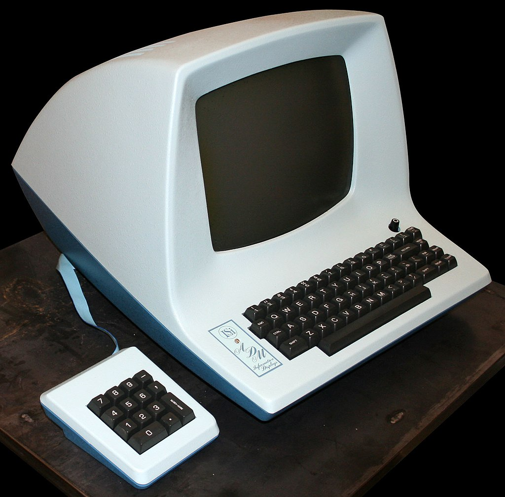
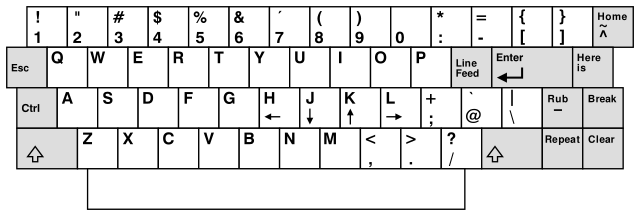
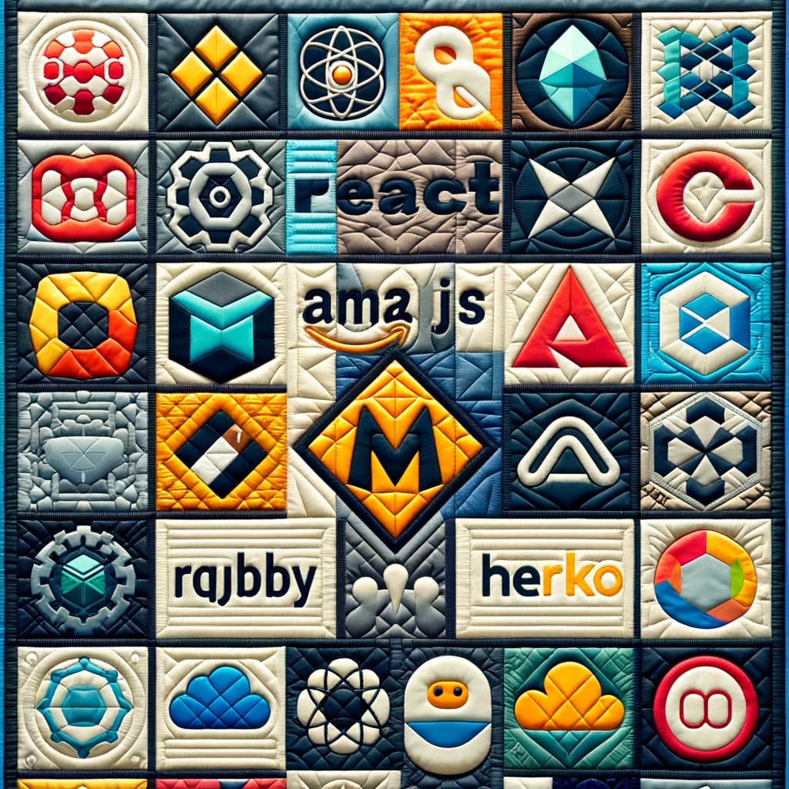
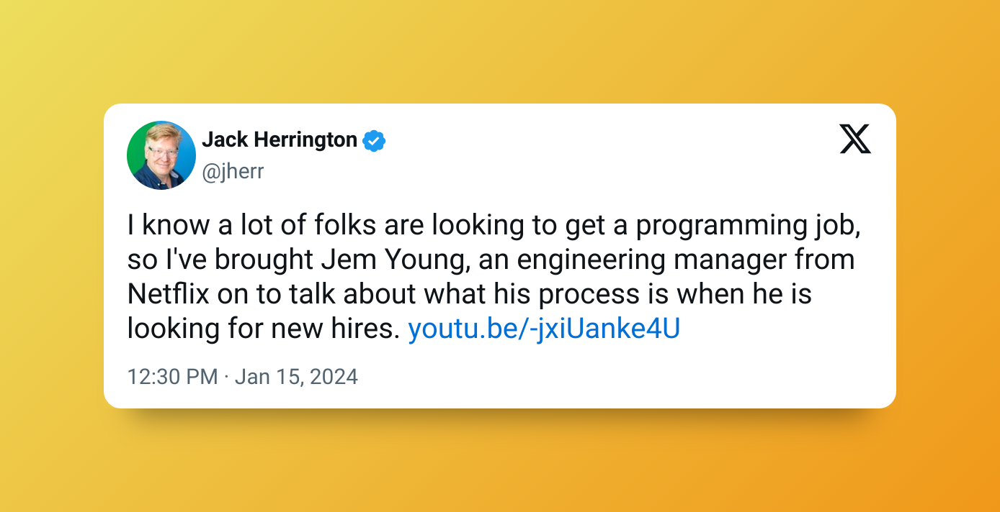
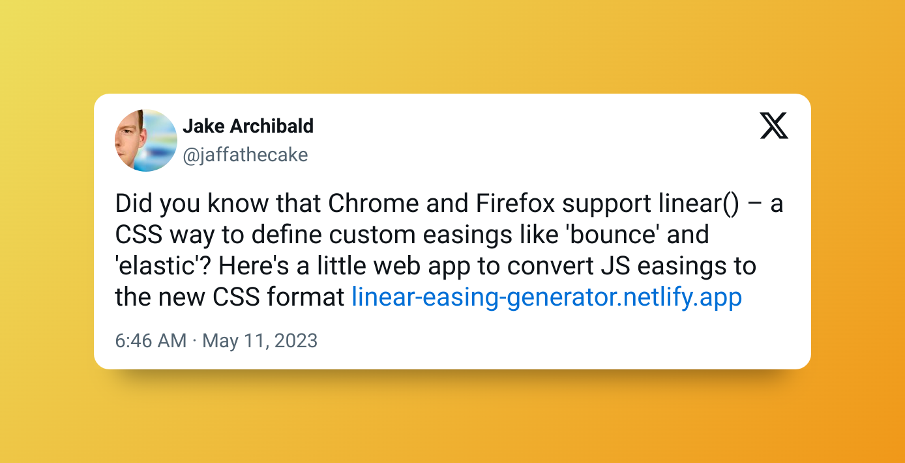
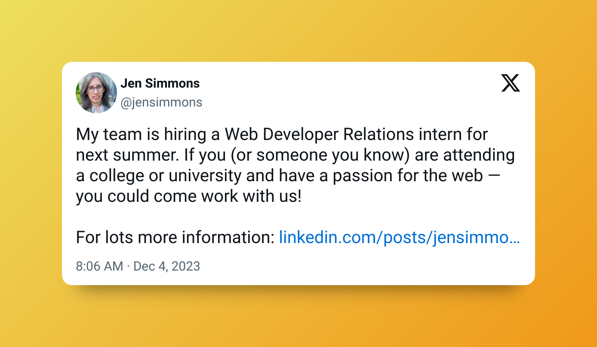
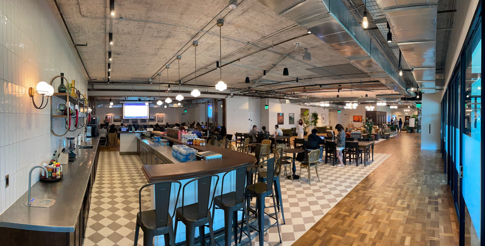
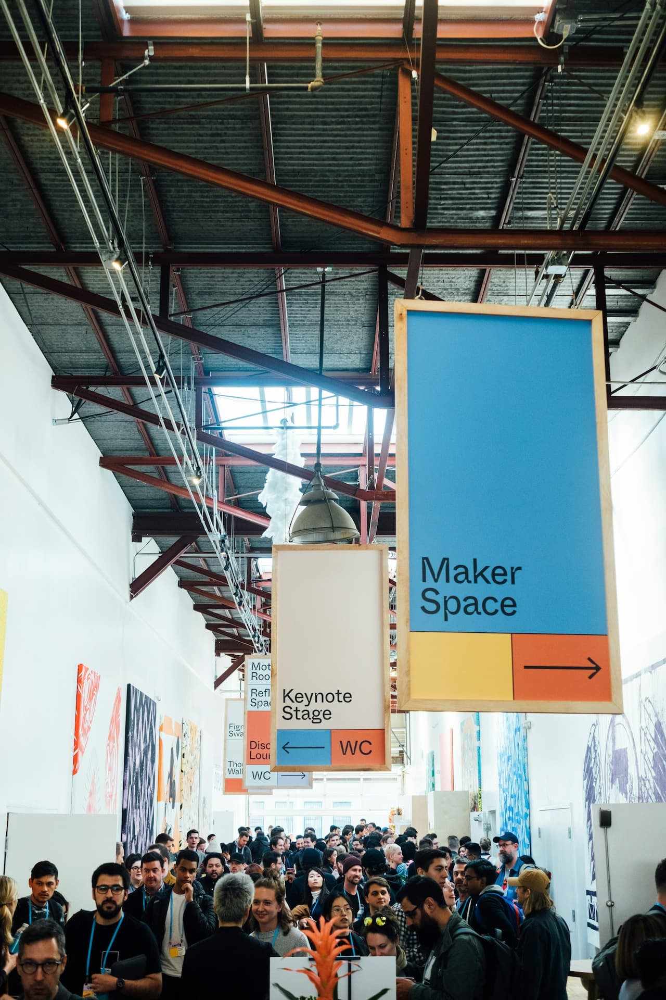

<style>
  :root {
    --color-background: #fff;
    --color-background-code: #fff;
    --color-background-paginate: rgba(128, 128, 128, 0.05);
    --color-foreground: #444;
    --color-highlight: #99c;
    --color-highlight-hover: #aaf;
    --color-highlight-heading: #99c;
    --color-header: #bbb;
    --color-header-shadow: transparent;
  }
</style>


You made it.

# 👏

---

<!-- Make sure all of the images link to somewhere -->


# Don't Panic.

The Ironhacker's Guide to the Galaxy

---


### Let me be your guide.

My name is Sherwin, and my goal today is to leave you with a few tips, tricks, and anecdotes that will hopefully help you get to where you want to go.

---


Software Developer
Applicaster
Ironhack Alum


---

Ok, back to the first point.

# Don't panic.

---

Getting out of  is not that hard.


---

**Here are the essentials.**

- `:` + `wq` - To write and quit
- `:` + `qa!` - To quit and discard
- `:` + `line number` - To go to line
- `i` - To start typing
- `u` - To undo last change
- `ESC` - To get out of the last mode

---

**Beyond that you might not need to know the rest.**

- `dd` - To delete the line
- `O` - To start typing before the line
- `o` - To start typing after the line
- `g` + `g` + `d` + `G` - Select all and delete

---

<!-- This is a teachable moment -->

### Take a moment to try to understand the problem.

For example, Vi predates the usage of arrow keys and mice on computers.




---

**Why is Vim still relevant anyways?**

- It is the default text editor for many CLI tools
- It works well via SSH
- It is great for power users

---


#### Don't forget to pack the essentials.

Gather everything you have learned along the way and keep it in a central place.

[](https://notion.so) / [](https://obsidian.md) / [](https://evernote.com)

<!-- Keep your tools handy -->

---


---

Every time you find yourself strugglling to grasp something, take notes. Leave yourself breadcrumbs explaining how you solved something.

### Future you will be grateful.

---

<style scoped>
    h2 {
    position: absolute;
    color: #000;
    top: 0;
    left: 0;
    padding: 5rem;
  }
  h3 {
    position: absolute;
    color: #000;
    top: 0;
    right: 120px;
    padding: 5rem;
  }
  </style>


## Learn

### Git.

---


Similar to Vim you don't need to _master_ the thing, just don't let it _push_ you around.
\---

```sh
git reflog
```

^ Anybody know what this does?

---

Did you know about the `-p` flag when you use `mkdir`?

```sh
mkdir -p ~/code/cool-project/public/assets/
```

---

Where you go from here is entirely up to you, but be sure to pick up a few souveniers on the way...

---

<!-- Talk a little bit about my journey, and the things I gathered on the way  -->

#### Be ready to learn.

Don't limit yourself to a specific technology.



---

#### Get people to review your code.

and

#### Spend some time looking at code.

---

Excerpt from [logzio-nodejs](https://github.com/logzio/logzio-nodejs/blob/master/lib/logzio-nodejs.js) library

```js
const jsonToString = (json) => {
  try {
    return JSON.stringify(json);
  } catch (ex) {
    return stringifySafe(json, null, null, () => {});
  }
};

const messagesToBody = (messages) => messages.map(jsonToString).join(`\n`);

const UNAVAILABLE_CODES = [
  "ETIMEDOUT",
  "ECONNRESET",
  "ESOCKETTIMEDOUT",
  "ECONNABORTED",
];

const zlibPromised = (body) =>
  new Promise((resolve, reject) => {
    zlib.gzip(body, (err, res) => {
      if (err) return reject(err);
      return resolve(res);
    });
  });
```

---

### Keep an ear to the streets.

One thing you can always count on, is that the industry will keep evolving. It is important that you understand up to date with what is going on in the industry, or else you will find yourself in an unfamilliar place.

---

[](https://survey.stackoverflow.co/2023/) [](https://www.levels.fyi/?compare=Citrix,UKG,American%20Express&track=Software%20Engineer)

---


### You are not alone on this journey.

The community is this industry's most valuable resource, do not take it for granted.

<!-- Really have to drive this one home  -->

---

<style scoped>
  section {
    color: #000;
  }

  strong {
    position: absolute;
    top: 40px;
    left: 0;
    width: 100%;
    background: rgba(40, 120, 80, 0.5);
  }

  img {
    margin-left: 3.3rem;
    padding: 0;
  }
  </style>


 | Twitter

---

<style scoped>
  img {
    position: absolute;
    top: 0;
    left: 0;
    padding: 0;
    margin: 0;
  }
  </style>

[](https://twitter.com/jherr)

---

<style scoped>
  img {
    position: absolute;
    top: 0;
    left: 0;
    padding: 0;
    margin: 0;
  }
  </style>

[](https://twitter.com/jaffathecake)

---

<style scoped>
  img {
    position: absolute;
    top: 0;
    left: 0;
    padding: 0;
    margin: 0;
  }
  </style>

[](https://twitter.com/jensimmons)

---

<style scoped>
  h4, h6 {
    color: #fff;
    padding: 0 1rem;
    background: rgba(0,0,0, 0.5);
    margin: 0;
  }
  </style>


###### You never know where the people you meet might take you.

#### Try not to burn your bridges.

---

One of you may be my next boss.

<!-- Taake a moment to talk about Davin, and many more anecdotes  -->

---

<style scoped>
  h1 {
    color: #fff;
    padding: 1rem;
    background: rgba(0,0,0, 0.5);
    margin: 0;
    position: absolute;
    left: 0;
    text-align: right;
  }
  </style>

# Go to events.



---

Upcoming Events:

- [Product People Meet, Jan 25](https://www.eventbrite.com/e/product-people-meet-tickets-787747803887) | Citizen M Brickell

- [Python / Jypeter 101, Jan 27](https://www.meetup.com/hackmiami/events/298596530/) | Akamai Ft Lauderdale

- [Ft Lauderdale Tech, Feb 13](https://www.eventbrite.com/e/fort-lauderdale-tech-meetup-tickets-501242087577) | The Fitz Bar Ft Lauderdale
- [Shift Conference, April 23](https://shift.infobip.com/us/) | Perez Art Museum Miami
- [Hack Miami Conference, May 15](https://www.eventbrite.com/e/hackmiami-conference-xi-2024-tickets-752410940377) | Marena Miami Beach

---

### The Job Hunt.



- Be creative with your search
- Know what skills are in demand
- Make yourself marketable
- Keep learning, don't just stop here

---

### Be confident in what you have learned.

Apply it to something else.

---

<style scoped>
  section {
    color: #000;
  }
  img {
    position: absolute;
    top: 10px;
    left: 70px;
  }

  h3 {
    margin: 0;
  }
  </style>


### everywhere.

Don't limit yourself to just a few devices, you could take what you learned here [and use it at SpaceX](https://www.reddit.com/r/spacex/comments/gxb7j1/comment/ft6bydt/?utm_source=share&utm_medium=web3x&utm_name=web3xcss&utm_term=1&utm_content=share_button)

---


Where to next?

