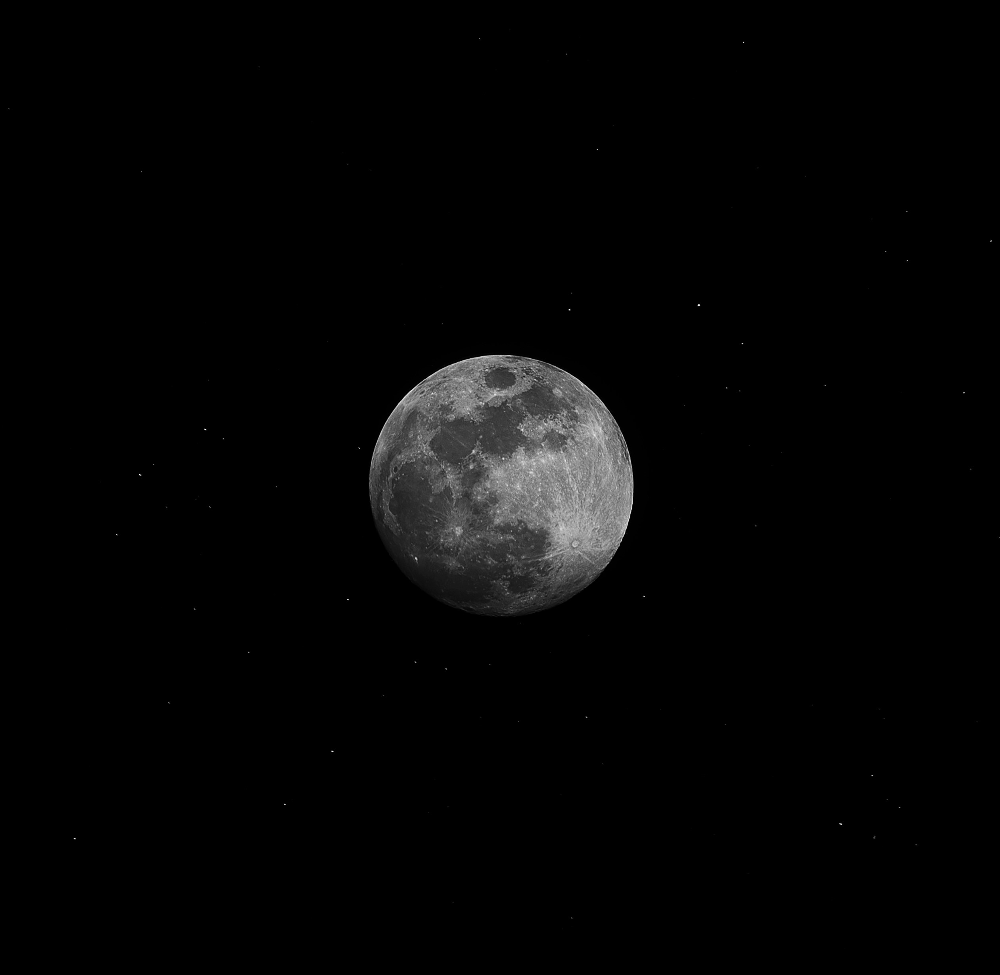
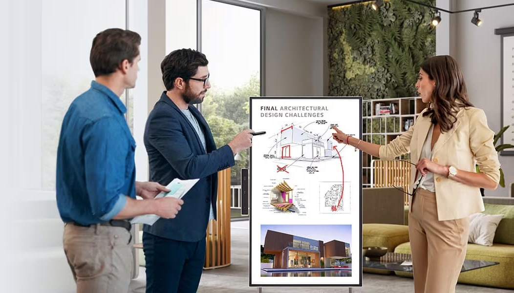
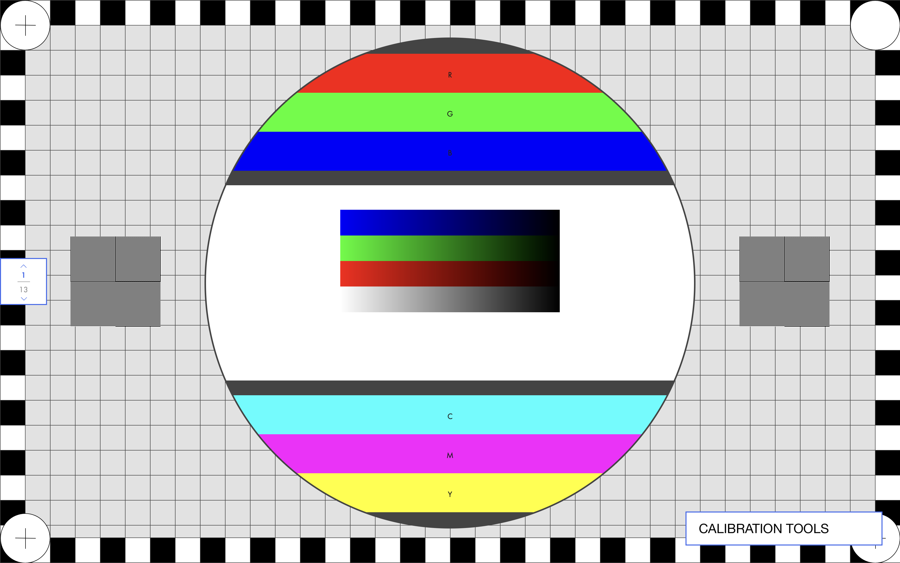
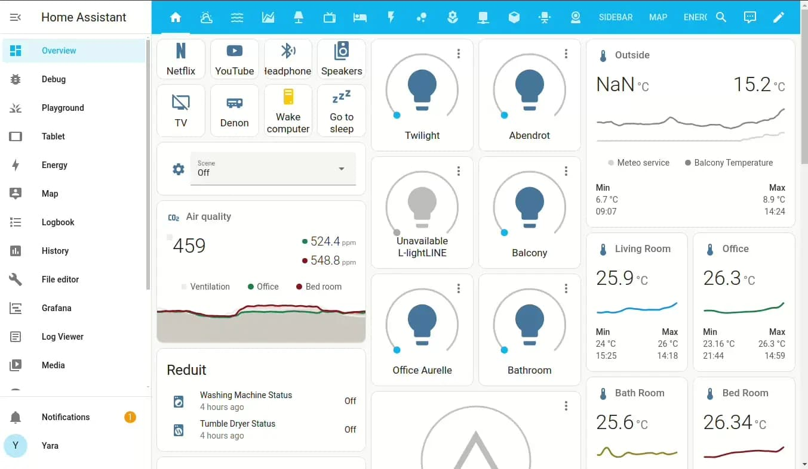
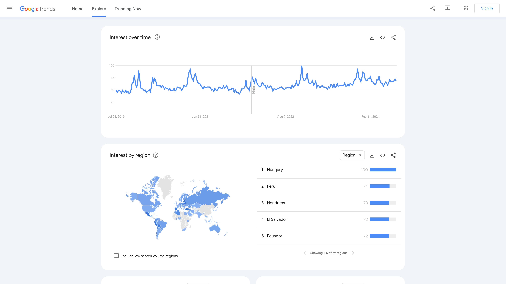
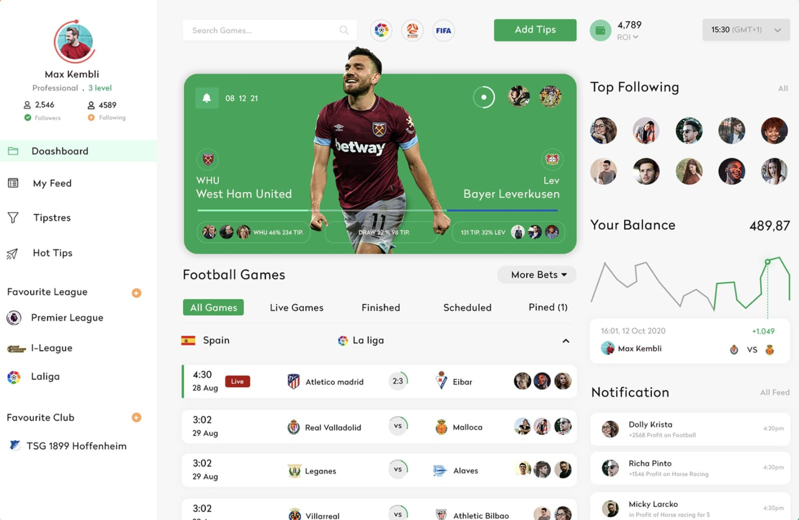
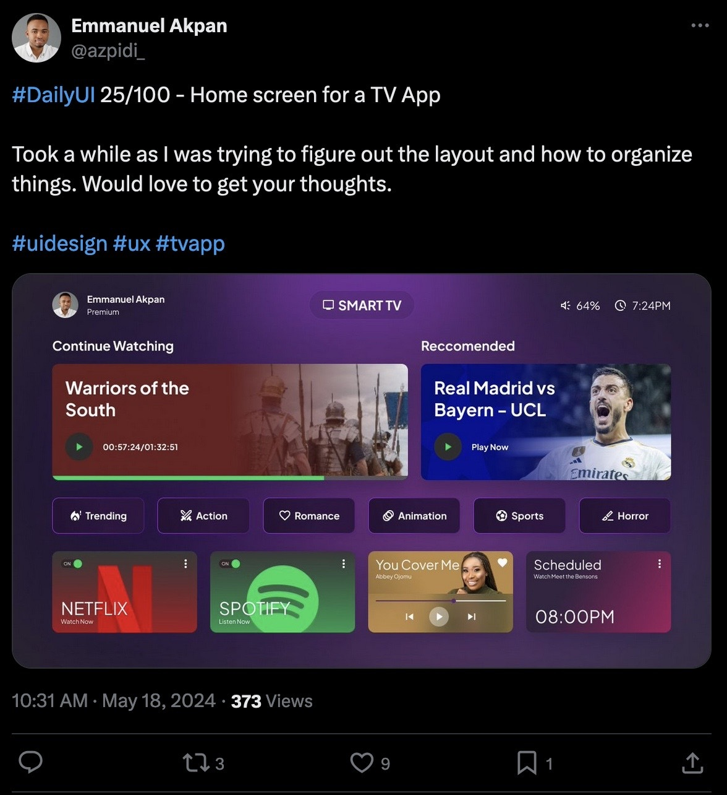

<!-- Photo by Alexander Andrews on Unsplash -->

#### M:S
###### Moon Suite: collection of interactive utils

---

##### TV Reimagined

 TVs can be used for more than just entertainment, and M:S is designed so that we could use it as an interactive display device

---

<!--  -->

**What is M:S?**

The Moon Suite is a collection of interactive tools that are designed to bring additional functionality to your TV. 

**What kind of tools?**

Calibration tools, dashboards, and interactive media that allows you to do more than just consume content. 

---

---

**Calibration Tools**

Run a series of utilities or exercises that can help you calibrate your display to your need. Check the resolution, gamma, motion and more to see what your panel is capable of.

---

---

**Smart Home Dashboards**

Control your lights, pause music playback on a wifi speaker, change the temperature in your home and more.

---

---

**Custom Dashboards**

Create your own interactive display, make a dashboard that shows the score of your favorite teams, subscribe to certain google trends, and more.

---

---

**Sports Dashboard**

Dedicate a display to stay up to date with the latest sports statistics. Subscribe to your favorite teams.

---

**Canvas Dashboard**

Create an interactive photo album or scratchbook where you could share photos with your family from within the dashboard.

---

**Don't forget about the community.**

One of our main goals is to have user generated tools in the suite, we are designing M:S in an extensible way.

---

The community is full of great ideas, and it would be ideal to let users create the experiences they want.

---

<!-- Photo by eberhard 🖐 grossgasteiger on Unsplash -->

 + 

### M:S

The Moon Suite will be a clientside web based application will leverage the webOSTV.js and luna APIs.

---

**Compatability**

We will ensure that M:S will support a wide range of LG webOS devices (webOS 4 - webOS 24)

---

M:S is still a work in progress, so feel free to subscribe to the public repo for any updates.

---

Built in Miami Beach

by [sherwino](https://github.com/sherwino) & [tzikas](https://github.com/Tzikas)
